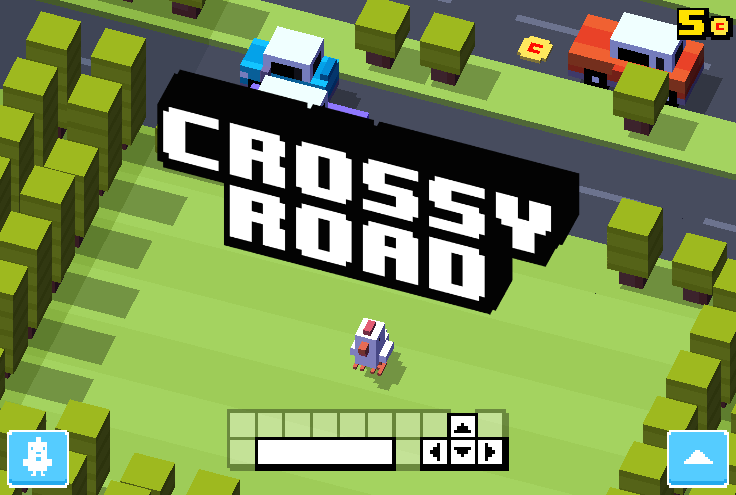

# Crossy Road HTML5 Recompiled

[](https://threejs.org/)
[](https://python.org/)

<p align="center">
  
</p>

> Una versión recompilada del clásico juego **Crossy Road**, desarrollada en colaboración con **Poki Games** y **Whipster Whale**, utilizando la poderosa librería **Three.js** para gráficos 3D en el navegador.

---

## 📸 Vista previa

<p align="center">
  
</p>

---

## 🚀 Instalación y ejecución

### 📋 Requisitos previos

Asegúrate de tener instalado lo siguiente:

- [Python](https://python.org/) (v3.14.0 o superior)
- [Git](https://git-scm.com/)
- Un navegador web moderno (Chrome, Firefox, Edge, etc.)

---

### ⚙️ Pasos para ejecutar

Clona el repositorio y ejecuta un servidor local con Python:

```bash
# Clonar el repositorio
git clone https://github.com/audioasilvab/crossyRoad_HTML5.git

# Acceder al directorio del proyecto
cd crossyRoad_HTML5

# Iniciar servidor HTTP
python -m http.server 8000
